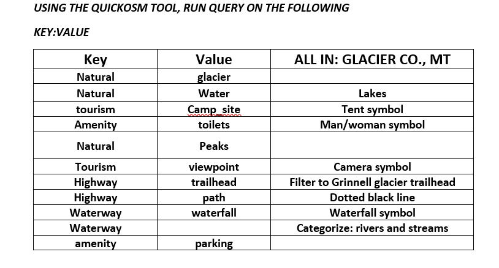

# MANY GLACIER MAP: Utilizing QGIS 

## Project Contents

If you wanted to include a table of contents to sections, and then links to each section.

- [Data Source](#Data-Source)
- [Project Background](#project-background)
- [Purpose](#Purpose)
- [Mapmaking Process](#Mapmaking-process)

***

### Data Source

* Using the QUICKOSM Tool and OpenStreetMap Wiki to find specifice tags for the desired layers
[Wiki Link](https://wiki.openstreetmap.org/wiki )
* Elevation data downloaded from the USGS NED 1/3 arc-second raster digital elevation model. This data can be accessed at the USGS 3D Elevation Program [usgs.gov](https://apps.nationalmap.gov/downloader/)
* [cb_2022_us_county_500k.zip](https://www2.census.gov/geo/tiger/GENZ2022/shp/cb_2022_us_county_500k.zip) (Shapefile) filtered to "name"='Glacier'
* [cb_2022_us_state_500k.zip](https://www2.census.gov/geo/tiger/GENZ2022/shp/cb_2022_us_state_500k.zip) (Shapefile) filtered to "name"='Montana'
    * Source: [U.S. Census Bureau TIGER Products](https://www.census.gov/geographies/mapping-files/time-series/geo/cartographic-boundary.html) 

* Initial Data projection: EPSG:4326- WGS84
* Final Map projection: EPSG: 32100- NAD83/Montana

### Project Background

This map was created to provide a helpful guide to anyone that has a limited amount of time while visiting Glacier National Park. GNP covers over 1 million acres, which is why I chose to focus on the Many Glacier area aka the "Switzerland of North America". Many Glacier is on the northeast side of GNP and has some of the most iconic hiking trails and glaciers in the entire park. With so much to see, it can feel overwhelming for a first timer. A concern for some visitors is feeling altitude sickness. For this reason, included on the map are elevation contours. If you are coming from flatland, studying the contours can help determine the amount of physical exertion that will be required to complete the hike. Other important features on the map include bathrooms, camping sites, and scenic viewpoints. My favorite hike is the Grinnell Glacier Trail. While hiking, I would have liked to know the names of the mountain peaks, lakes, and other geographic features. 

   
*Picture of Grinnell Lake taken from the Grinnell Glacier Trail *

### Purpose

### Mapmaking Process
### OpenStreetMap Plugin for Adding Layers

The third column in the chart is used to explain the symbology and filter used during the editing process for each layer. The Drop Fields tool was used to narrow down the attributes table after each query. A query that was accidentally not included, key: highway value: secondary, filtered to "name"='Going-to-the-sun Road'. 

### Create Elevation Data for Many Glacier

1. **Example bold**
2. *Example italics*
3. 
4. 

### Map summary

Across the README.md file, please answer the who, what, when, where, why, and how of the map making process

## Final Project Link

Please view the [final map online](www.github...)

[def]: #https://wiki.openstreetmap.org/wiki
