# MANY GLACIER VALLEY TRAIL MAP: Utilizing QGIS 

## Project Contents

- [Data Source](#Data-Source)
- [Project Background and Purpose](#project-background-and-purpose)
- [Mapmaking Process](#Mapmaking-process)
- [Future Ideas](#Future-Ideas)

***

### Data Source

* Using the QUICKOSM Plugin Tool and OpenStreetMap Wiki to find specifice tags for the desired layers
[Wiki Link](https://wiki.openstreetmap.org/wiki )
* Elevation data downloaded from the USGS NED 1/3 arc-second raster digital elevation model. This data can be accessed at the USGS 3D Elevation Program [usgs.gov](https://apps.nationalmap.gov/downloader/)
* [cb_2022_us_county_500k.zip](https://www2.census.gov/geo/tiger/GENZ2022/shp/cb_2022_us_county_500k.zip) (Shapefile) filtered to "name"='Glacier'
* [cb_2022_us_state_500k.zip](https://www2.census.gov/geo/tiger/GENZ2022/shp/cb_2022_us_state_500k.zip) (Shapefile) filtered to "name"='Montana'
    * Source: [U.S. Census Bureau TIGER Products](https://www.census.gov/geographies/mapping-files/time-series/geo/cartographic-boundary.html) 

* Initial Data projection: EPSG:3857- WGS84
* Final Map projection: EPSG: 32100- NAD83/Montana

### Project Background and Purpose

This map was created to provide a helpful guide to anyone that has limited time while visiting Glacier National Park (GNP). GNP covers over 1 million acres, which is why I chose to focus on the Many Glacier area a.k.a the "Switzerland of North America". Many Glacier is on the northeast side of GNP and has some of the most iconic hiking trails and glaciers in the entire park. With so much to see, it can feel overwhelming. A concern some visitors have is feeling altitude sickness. For this reason, included on the map are elevation contours. If you are coming from flatland, studying the contours can help determine the amount of physical exertion that will be required to complete the hike. Other important features on the map include bathrooms, camping sites, and scenic viewpoints. While touring the park years ago, I discovered my favorite hike was the Grinnell Glacier Trail. Prior to hiking, I wish I researched the surrounding geologic features and knew the names of the mountain peaks & lakes I passed. The next time I go, I will be more prepared and will be able to discover new trails and scenery at Many Glacier.  

   
*Picture of Grinnell Lake from the Grinnell Glacier Trail taken by Jamie*

### Mapmaking Process
The workflow will look like this:
1. Open QGIS
2. Add Basemap & Coordinate System
3. Run Queries for layers using QUICKOSM Plugin Tool
4. Add USGS elevation Data and extract contours
5. Customize layers and symbology
   
### OpenStreetMap Plugin for Adding Layers

**Steps 1 & 2:** Open QGIS, under browser:XYZ Tiles, add the basemap OPENSTREET MAP.
The Project Coordinate System we will be using is EPSG:32100. You can change this by going to Project Properties-CRS.

Using the Data Sources above, download Counties [cb_2022_us_county_500k.zip](https://www2.census.gov/geo/tiger/GENZ2022/shp/cb_2022_us_county_500k.zip) and States [cb_2022_us_state_500k.zip](https://www2.census.gov/geo/tiger/GENZ2022/shp/cb_2022_us_state_500k.zip) 
Unzip the zip files. In QGIS go to Layer on the top menu, add layer, then add vector layer. Add .shp files for counties and states to the map. Then filter accordingly by right clicking each layer, going to filter, and filter the state layer to show "name"='Montana' & county layer to show "name"= 'Glacier'

**Step 3:** Run Queries for layers using QUICKOSM Plugin Tool.
This step was time consuming. It combines finding the correct key:value tags, using the Drop Fields tool, filtering these layers, and later customizing them with symbology and labels. 

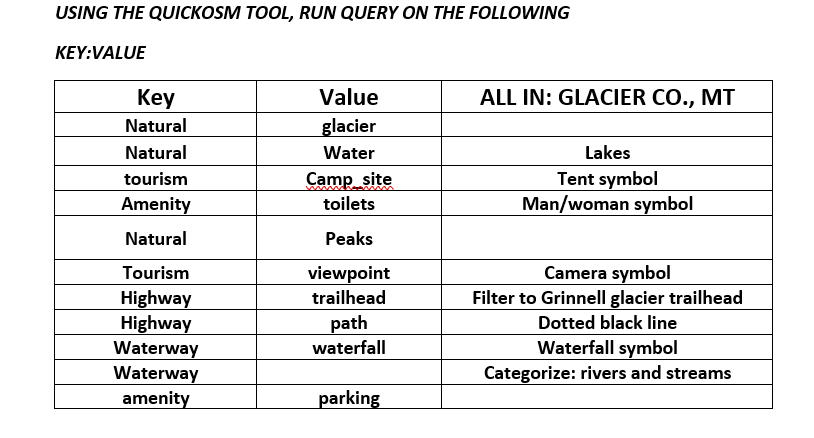

*Information provided for customizing the map using the QuickOSM Plugin Tool in QGIS*

The third column in the chart is used to explain the symbology and filters used during the editing process for each layer. The Drop Fields tool (found in the Processing Toolbox) was used to narrow down the attributes table after each query. One query that was inadvertently not included in the above chart, **Key: highway Value: secondary, filtered to "name"='Going-to-the-Sun Road'** I wanted to highlight Going-to-the-Sun Road because it is the main road to take through the park and leads visitors to a majority of the trails and scenic viewpoints.  

### Download Elevation Data for Many Glacier
**Step 4:** Using the link [usgs.gov](https://apps.nationalmap.gov/downloader/) , navigate to the search box and type Many Glacier, MT.
To the left of the map, you will use the Elevation Products (3DEP).

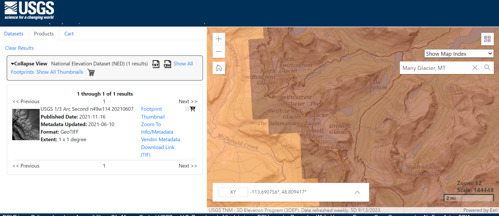
*This is what the elevation data should look like*

Download the elevation data from the USGS NED 1/3 arc-second raster digital elevation model. File format GeoTIFF.

### Create elevation contours with GDAL

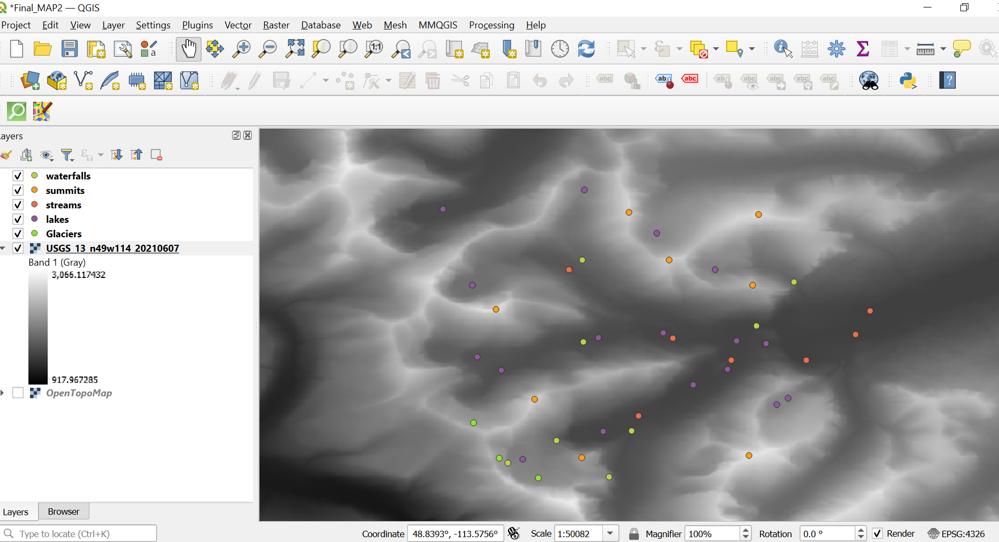
*Add raster data USGS_13_n49w114_20210607.tif into QGIS*

   a.	Clip Raster by Extent to site defined at 1:25,000 scale. Click on Raster on the menu -> Extraction -> Clip Raster by extent. Use    the Draw on Canvas option
   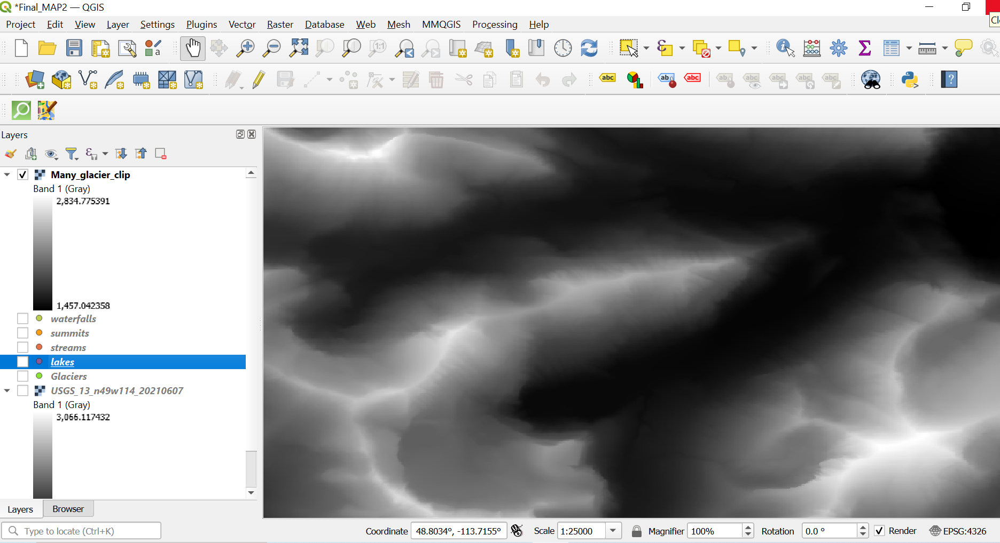
  	*After Clip by Extent*
  	
   b.	Use the Raster Calculator to convert elevation units from meters to feet.
     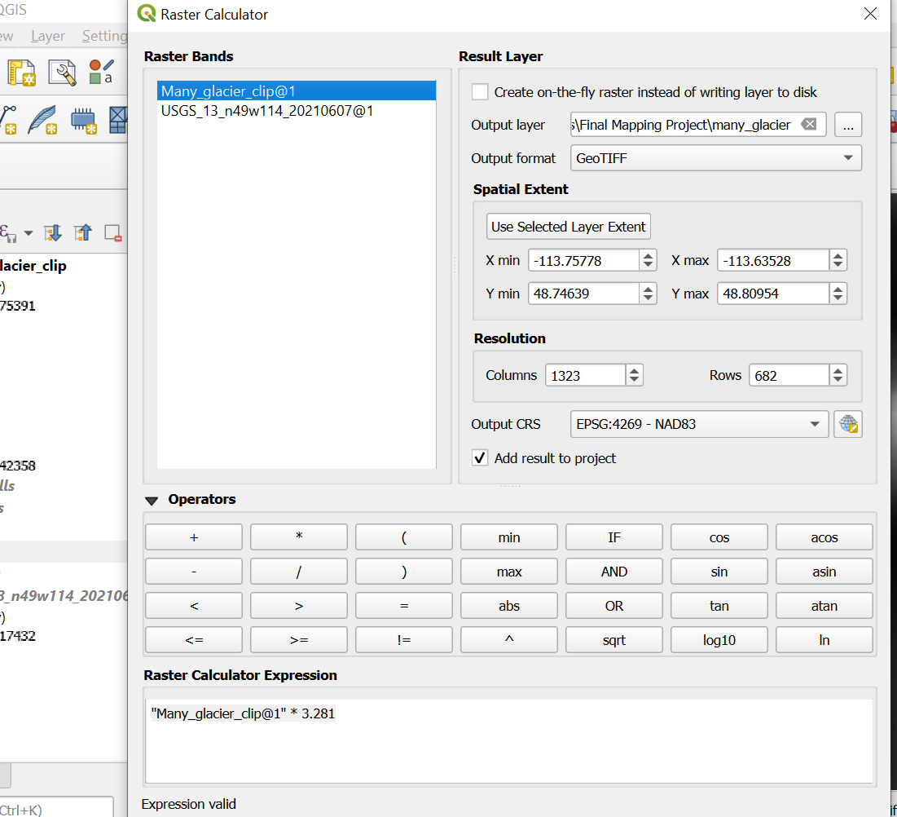
   *Raster Calculator: Use expression "Many_glacier_clip@1" * 3.281*
  	
   c.	Make elevation contours with a 20-foot interval.
   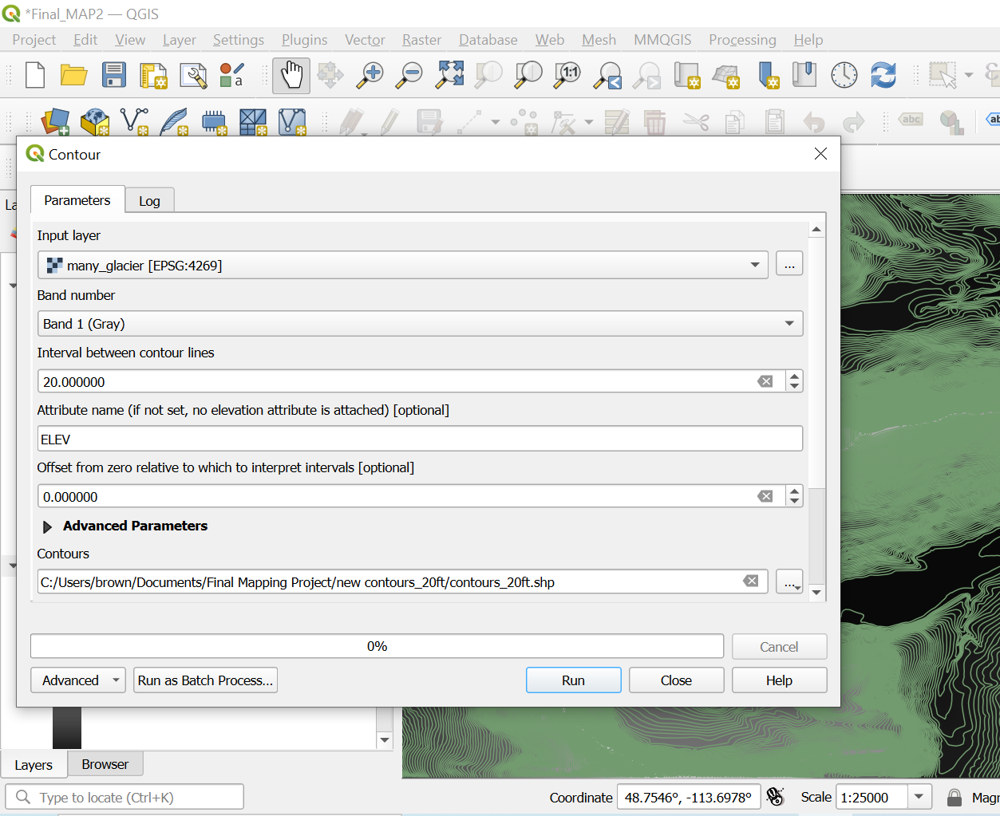
   *Raster Extraction Settings*

   d.	Field Calculator to make index contours for every 20 feet. An index contour has an attribute that allows us to symbolize it             differently on the map.
   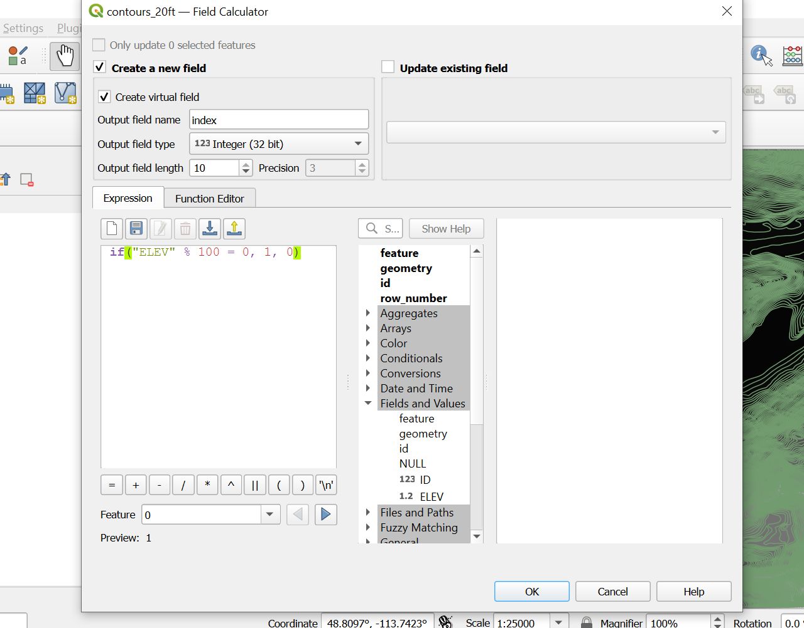
*Adding the field name Index to symbolize "1" and "0" separately on the map*

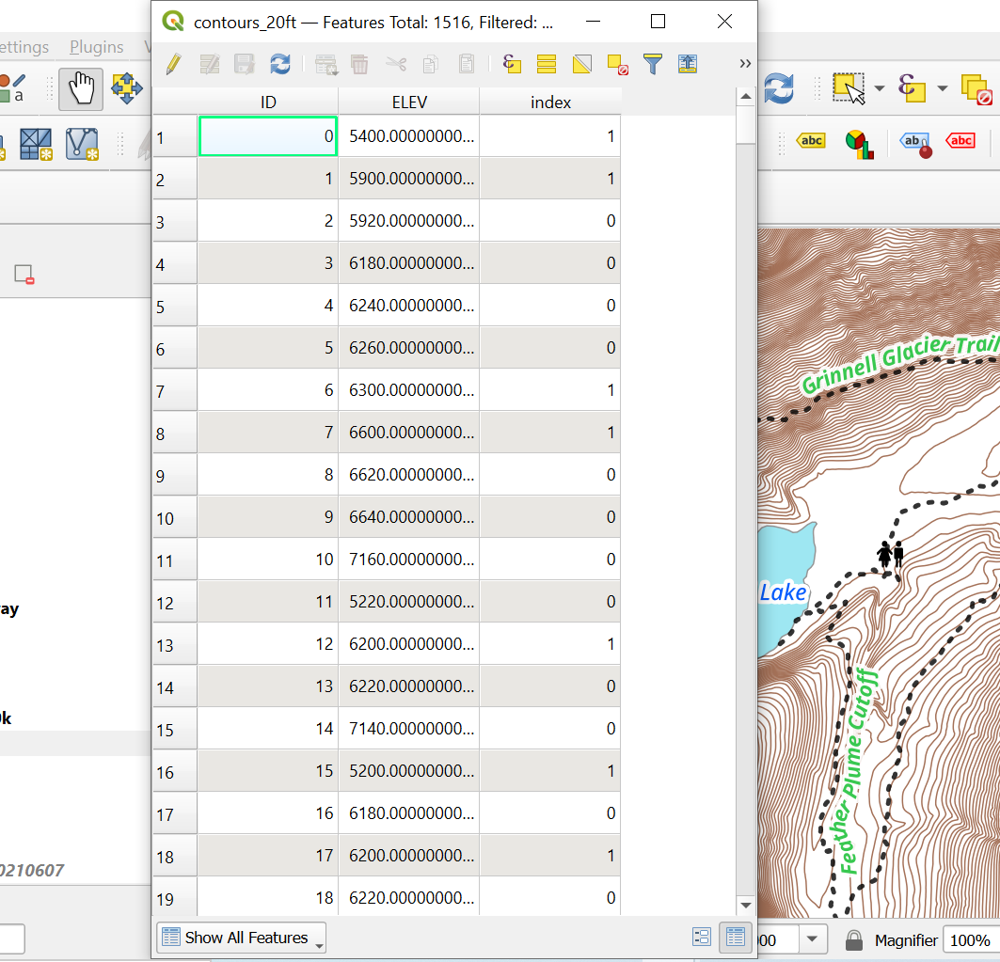
*What the attribute table should look like after adding the new field name Index*

Now, edit the contour layer with rule-based zoom
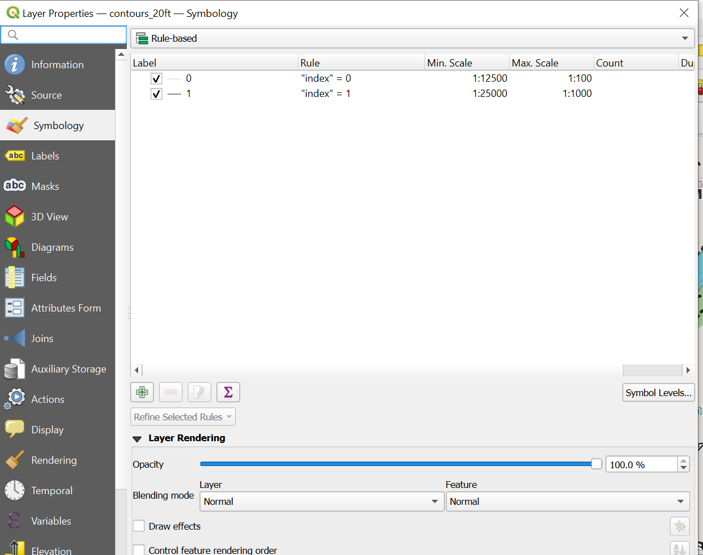
*Use rule based zoom for the Contours_20ft layer for Index 1 & 0* 

Right-click on the Contours_20ft layer, go to properties, symbology, scroll down to rule-based, and add rules for Index 1 & 0 to show contours as you zoom in

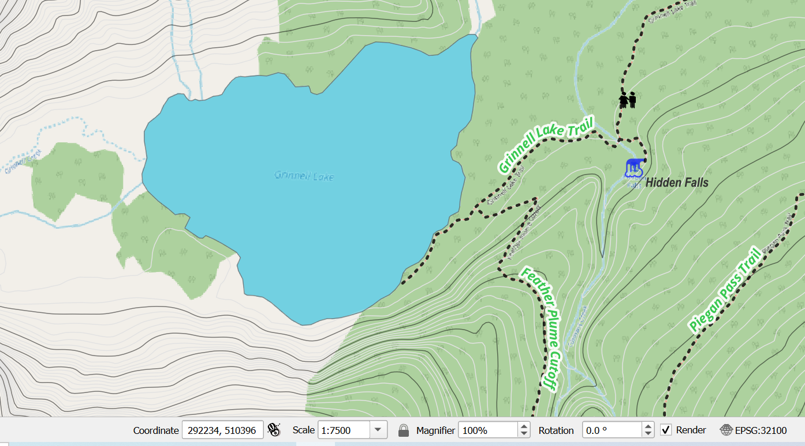
*Contour lines appearing at 1:7500*

**Step 5:** Customizing Layers and adding Symbology

I saved this step for the end. It can be fun putting the finishing touches on your map. Choosing a SVG image for different layers and the font size and colors for labels will help make the map easier to read and hopefully visually pleasing. 

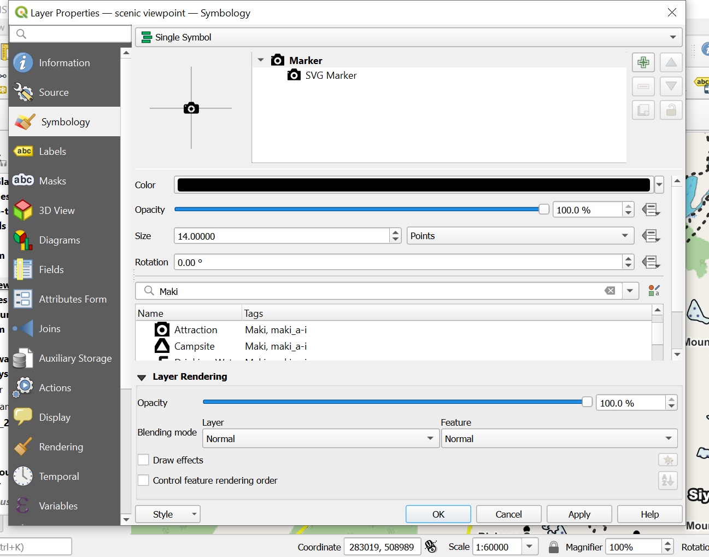
*Example of editing the layer for Scenic Viewpoints by adding SVG image of camera*

### Map summary
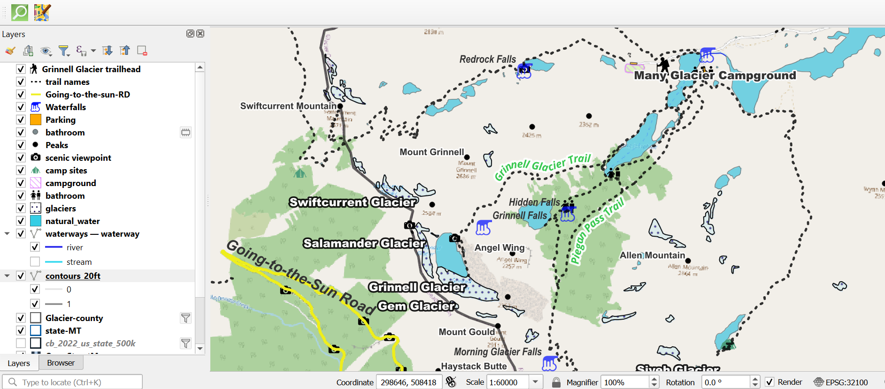
*The final map and list of layers will look like this when zoomed out*

### Future Ideas
There is a lot of research at GNP on the effects climate change is having on glaciers. I would like to add different layers showing how Grinnell Glacier has been shrinking over the years. Also, it would be neat to link pictures to each of the scenic viewpoints.

## Final Project Link

Please view the [final map online](http://127.0.0.1:5500/index.html)

[def]: #https://wiki.openstreetmap.org/wiki
